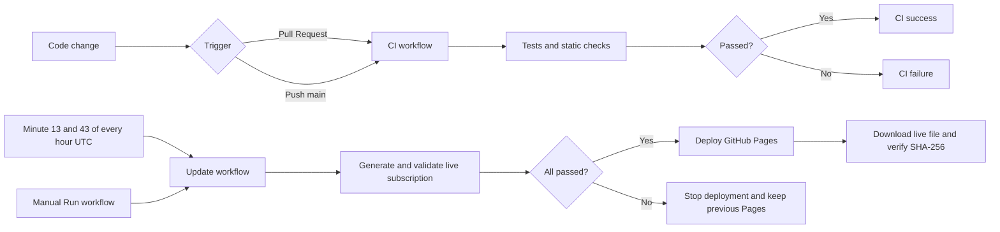
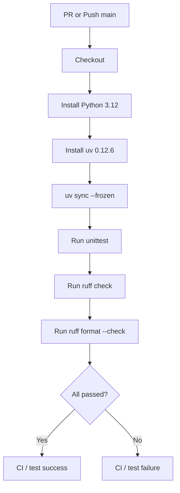
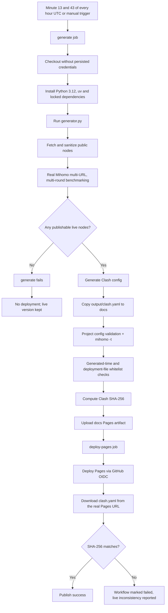

# CI/CD Process

This document explains this project's continuous integration (CI) and continuous deployment (CD) processes on GitHub. The project does not rely on self-hosted servers, and Actions never commits generated files back to `main`; the final subscription is published through a GitHub Pages artifact.

## Workflow overview

| Workflow | File | Triggers | Main responsibilities |
| --- | --- | --- | --- |
| CI | `.github/workflows/ci.yml` | Pull Request, pushes to `main` | Unit tests, Ruff checks, format checks |
| AI Self-Healing Proxy v7 | `.github/workflows/update.yml` | Minute 13 and 43 of every hour UTC, manual trigger | Live generation, quality validation, Pages deployment, live verification |



> CI and CD are two independent workflows. Pushing to `main` triggers CI but does not immediately trigger deployment; the subscription updates at the next half-hourly schedule slot or when `AI Self-Healing Proxy v7` is run manually. `update.yml` never proactively queries the latest CI result.

## CI process

CI is defined in `.github/workflows/ci.yml`.

### Triggers

- Creating or updating a Pull Request.
- Pushing code to `main`.
- It does not run again during the half-hourly subscription updates.

When a new commit lands on the same Git ref, `cancel-in-progress: true` cancels the still-running old CI so a runner is not wasted on an already-outdated commit.



Exact commands:

```bash
uv sync --frozen
uv run python -m unittest discover -s tests
uv run ruff check .
uv run ruff format --check generator.py tests/test_generator.py
```

`uv sync --frozen` requires strict use of `uv.lock`; it fails outright when the lock file is inconsistent with the declared project dependencies, so CI never silently updates dependencies.

### CI and branch protection

If you want all code entering `main` to require CI, configure it in the GitHub repository:

1. Open **Settings -> Branches** or **Settings -> Rules -> Rulesets**.
2. Enable Pull Request/branch protection for `main`.
3. Set `CI / test` as a required status check.

Without that repository setting, the workflow itself can only report CI success/failure; it cannot stop privileged users from directly merging or pushing failing code.

## CD process

CD is defined in `.github/workflows/update.yml` and consists of two jobs: `generate` and `deploy-pages`.

### Triggers and concurrency

The schedule expression is:

```yaml
cron: "13,43 * * * *"
```

It fires at minute 13 and 43 of every hour UTC, avoiding the common scheduling peaks at the top and middle of the hour and refreshing GitHub's schedule registration via an actual cron change. GitHub Actions scheduled tasks can still be delayed or dropped due to platform load, with no guarantee of punctuality or delivery.

It can also be run manually from the Actions page via `workflow_dispatch`.

All runs use the `proxy-pages-production` concurrency group with `cancel-in-progress: false`:

- Two production publishing flows cannot concurrently overwrite Pages.
- A publishing run that already started is never cancelled by the next scheduled run.

### Overall publishing flow



## generate job details

### 1. Least-privilege initialization

`generate` inherits the workflow-level `contents: read`, so it can only read the repository — it cannot commit code or deploy Pages.

Checkout uses:

```yaml
persist-credentials: false
```

so Git credentials are never kept in the workspace. All third-party Actions are pinned to full commit SHAs so a replaced floating tag cannot silently change pipeline behavior.

### 2. Live generation

Generation always sets:

```text
FREE_PROXY_AIRPORT_DISABLE_MIRRORS=1
FREE_PROXY_AIRPORT_REQUIRE_LIVE=1
```

These two settings control mirror sources and live-node admission.

- Downloading Mihomo from third-party mirrors is forbidden.
- At least one live node meeting the publication gate is required this round.
- Historical nodes or the local `DIRECT-FALLBACK` are never accepted as publishable live results.

The generator mainly performs the following 6 steps:

1. Fetch proxy nodes from public sources.
2. Normalize, filter, deduplicate and cap the candidate count.
3. Benchmark nodes with real Mihomo across multiple URLs and three rounds.
4. Keep only nodes with latency ≤ 800ms, 3/3 rounds passed and jitter ≤ 300ms.
5. Generate `output/clash.yaml`.
6. Copy it to `docs/clash.yaml` and ensure `docs/.nojekyll` exists.

When no node passes the quality gate, `generate` fails immediately and `deploy-pages` never runs.

### 3. Clash/Mihomo validation

Run:

```bash
uv run python generator.py --validate-with-mihomo --config docs/clash.yaml
```

This command first calls the project's `validate_config()`, checking proxies, required groups, group types, references and routing rules; then it runs the real:

```bash
mihomo -t -f docs/clash.yaml
```

Only when both the project rules and Mihomo's native parsing pass does it proceed to the next step.

### 4. Generated-time validation

An inline Python check in the workflow confirms `generated-at` is within 1 hour of the current time, preventing stale configs from being published. The Clash config's structure, references and protocol compatibility are already covered by the previous stage's project validation and the real Mihomo validation.

### 5. Deployment-file whitelist

`docs/` must contain only:

```text
docs/.nojekyll
docs/clash.yaml
```

Symlinks, subdirectories and extra files are also rejected, so unrelated content is never packaged into Pages.

### 6. Summary and Pages artifact

`generate` computes the SHA-256 of `clash.yaml` and hands it to `deploy-pages` via a job output. Afterwards only `docs/` is uploaded as the GitHub Pages artifact — no duplicate diagnostic artifacts are uploaded, and the baseline files in the Git repo are left untouched.

## deploy-pages job details

`deploy-pages` must wait for `generate` to succeed:

```yaml
needs: generate
```

It holds only the permissions required for deployment:

```yaml
permissions:
  pages: write
  id-token: write
```

- `pages: write`: write a GitHub Pages deployment.
- `id-token: write`: obtain the deployment identity via GitHub OIDC.
- No `contents: write` is granted, so the deploy job cannot modify the repository.

`actions/deploy-pages` deploys the Pages artifact generated and validated in the same round. After deployment, the workflow downloads `clash.yaml` from the returned real Pages URL. The request appends the current `GITHUB_RUN_ID` as a query parameter to bypass CDN caching, and retries up to 12 times with a 5-second interval. The downloaded file's SHA-256 must exactly match the `generate` job output.

## Failure behavior

| Failure point | Result |
| --- | --- |
| CI tests or Ruff fail | CI is marked red; whether merging is allowed is decided by GitHub branch protection |
| Fetching, Mihomo download or benchmarking fails | `generate` fails, no deployment starts, Pages keeps the previous version |
| No node passes the publication gate | `FREE_PROXY_AIRPORT_REQUIRE_LIVE=1` fails generation, Pages keeps the previous version |
| Clash or file-whitelist validation fails | No Pages artifact is uploaded/deployed, Pages keeps the previous version |
| `deploy-pages` deployment fails | The workflow fails; GitHub Pages keeps the platform's last successfully deployed state |
| SHA-256 mismatch after deployment | The workflow is marked red and reports the live Clash file mismatch; this check happens after deployment and does not auto-roll-back — inspect the Pages/CDN state |

## Publishing boundaries

- GitHub Pages Source must be set to **GitHub Actions**, not **Deploy from a branch**.
- The repo's `docs/` and `output/` are only in-version baseline samples, not the data source for automatic deployment.
- Automatic generation never creates `Update subscriptions` commits or continuously bloats Git history.
- There is currently no manual recovery workflow that publishes the in-repo baseline samples; when automatic updates fail, the project relies on Pages keeping the last successful version.
- `generate` produces and validates content; `deploy-pages` only deploys and verifies live content; Pages/OIDC permissions are never exposed to the network-facing benchmarking process.